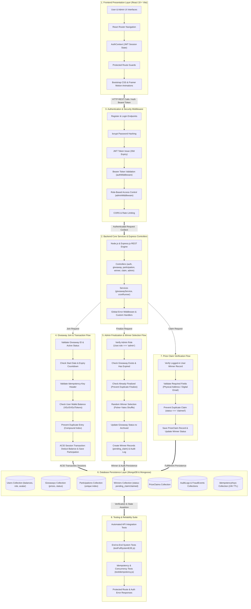

# VELOOP Rewards – Giveaway Platform

A complete, premium, and trustworthy full-stack giveaway platform designed to securely handle user participations, entry fees, and winner announcements.

## 🌟 Project Overview
The VELOOP Rewards Giveaway Platform is designed to provide a highly engaging, transparent, and secure experience for users to participate in exclusive giveaways. It features a React-based frontend providing a sleek, "fintech-inspired" aesthetic and a robust Node.js backend focused on transactional integrity, idempotency, and fraud prevention.

## 💡 Giveaway Concept
Users can browse active, upcoming, and past giveaways. Each giveaway offers premium physical or digital prizes (e.g., iPhone 15 Pro, Amazon Gift Cards). To join, users must spend a specified entry fee in virtual currencies (`VEs`, `SVEs`, or `Tokens`). The system securely deducts this balance atomically while recording their participation.

## ✨ Features
- **Complete Giveaway Lifecycle:** Seamlessly transition between Upcoming, Active, and Ended states.
- **Premium UI/UX:** Responsive design, tailored animations, and a custom `ThemedLoader` to elevate the user experience.
- **Atomic Balance Deductions:** MongoDB sessions ensure participation and balance deductions are completed securely or rolled back safely.
- **Fraud & Security Layer:** Real-time analysis of device fingerprints and request patterns to prevent abuse.
- **Dynamic Prize Claims:** Secure, backend-verified physical and digital prize claim flows restricted strictly to actual winners.

## 🔄 Giveaway States
1. **Upcoming:** Giveaways scheduled for the future. Users can preview prizes but cannot join.
2. **Active:** Giveaways currently open for participation. Countdowns reflect real remaining time.
3. **Ended:** The entry period has closed. The backend finalizes winners, and the UI shifts to winner reveals.
4. **Archived:** Historical giveaways whose winners have been successfully processed and moved to the "Previous Winners" history.

## 🔀 Technical Architecture, Validation & Workflow Diagram

Below is the complete end-to-end technical architecture, security validation pipeline, transaction processing engine, and database persistence flow for the VELOOP Rewards platform:

## 🏆 Winner System & Prize Claim System
- **Winner Selection:** Processed securely on the backend. Only the exact configured number of winners per prize (e.g., 1 for an iPhone, 5 for AirPods) are selected.
- **Prize Claim System:** When a user logs in and is detected as a winner, they are presented with a "Claim Prize" modal. 
  - **Physical Prizes:** Requires Full Name, Phone, Address, City, State, and PIN.
  - **Digital/Gift Cards:** Requires only an Email Address.
  - *Security:* The backend absolutely ignores client-provided prize types and verifies the required fields strictly against the authoritative database record.

## 🛠️ Technology Stack
- **Frontend:** React.js, Vite, Bootstrap, CSS Modules, Framer Motion, Lucide React
- **Backend:** Node.js, Express.js, MongoDB, Mongoose
- **Security:** JSON Web Tokens (JWT), Express-Rate-Limit, Crypto (Device Fingerprinting)

## 📂 Folder & Component Architecture

### Frontend Architecture
- `src/components/`: Modular UI elements (`GiveawayHero`, `PrizeCard`, `WinnerSlider`, `ThemedLoader`, `PrizeClaimModal`).
- `src/pages/`: Main views (`GiveawayHome`, `GiveawayDetails`, `GiveawayWinners`).
- `src/services/api.js`: Centralized API communication layer.
- `src/data/giveawayConfig.js`: Base UI configurations and fallback structures.

### Backend Architecture
- `src/controllers/`: Core business logic (`giveawayController`, `participationController`, `winnerController`, `claimController`).
- `src/models/`: MongoDB Schemas ensuring strict data types and unique constraints.
- `src/middleware/`: Request interceptors (`authMiddleware`, `fraudMiddleware`, `rateLimitMiddleware`).
- `src/routes/`: Express endpoints mapping to controllers.

## 📱 Responsive Design & Animations
The UI is fully responsive from `320px` to `1920px+`. 
- **Mobile:** Stacking layouts, horizontal scrollable prize cards, and touch-friendly tabs.
- **Desktop:** Expansive grid compositions and detailed winner sliders.
- **Animations:** Subtle interactions using Framer Motion (hover states, modal reveals, and continuous horizontal winner marquee) engineered to feel "rewarding" without resembling a casino/gambling platform.

## 🔒 Security & Fraud Protection
- **Idempotency & Race Conditions:** Backend employs compound unique DB indexes (`userId` + `giveawayId`) and MongoDB transactions. 
- **Device Fingerprinting:** `fraudMiddleware` hashes IP and User-Agent to detect and flag multi-account abuse attempts from a single device.
- **Untrusted Frontend:** The backend never trusts the frontend for `amount`, `currency`, `prizeType`, or `userId`. All values are resolved via authoritative DB queries.

## 🗄️ Database Models
- `Giveaway`: Configuration, lifecycle dates, and prize definitions.
- `Prize`: Nested within `Giveaway`, defining entry costs, currencies, and win limits.
- `GiveawayParticipation`: Immutable record of a user joining a giveaway.
- `GiveawayEntryTransaction`: Financial audit trail of the currency deduction (`PENDING`, `SUCCESS`, `FAILED`).
- `GiveawayWinner`: Record of selected winners.
- `PrizeClaim`: Fulfillment details securely submitted by verified winners.
- `FraudEvent` & `AuditLog`: Action tracking for administrative transparency.

## 🚀 Installation & Development

### Backend Setup
1. `cd backend`
2. `npm install`
3. Copy `.env.example` to `.env` and set `MONGO_URI` and `JWT_SECRET`.
4. `npm run dev` (or `npm start`)

### Frontend Setup
1. `cd frontend`
2. `npm install`
3. `npm run dev`

### Production Build
1. Inside `frontend`, run `npm run build` to generate the production `/dist` folder.

## 🧪 Testing
- **Frontend States:** Test UI by toggling mock authentication states in `AuthContext` to simulate Visitor, Participant, Winner, and Non-Winner.
- **Backend Flow:** Use tools like Postman to hit `/api/giveaways/:id/join`. 
  - Test *Insufficient Balance* (should reject).
  - Test *Duplicate Join* (should reject with 400).
  - Test *Claim Submission* (requires manually seeding a `GiveawayWinner` record matching the logged-in JWT user).

## 📡 API Documentation

| Method | Endpoint | Auth Required | Description |
|--------|----------|---------------|-------------|
| GET | `/api/giveaways/current` | No | Fetch active giveaways |
| GET | `/api/giveaways/:id` | No | Fetch details for a specific giveaway |
| GET | `/api/giveaways/:id/winners` | No | Get winners for a specific giveaway |
| GET | `/api/giveaways/previous/winners` | No | Get winners across all historical giveaways |
| GET | `/api/giveaways/:id/my-status` | Yes | Get the authenticated user's participation status |
| POST | `/api/giveaways/:id/join` | Yes | Deduct balance and record participation |
| POST | `/api/giveaways/:id/claim` | Yes | Submit physical or digital prize claim details |

## 🌐 Deployment
The frontend is optimized for deployment on Vercel or Netlify. The backend can be deployed on Heroku, Render, or any standard Node.js environment. Ensure proper `.env` variable configuration on the production servers.
